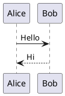

# Project Documentation System

Reusable Node.js documentation server for project Markdown files and OpenAPI/Swagger specifications.

## Install

```bash
npm install --save-dev @leandrose/project-documentation
```

## Usage

The package is published as `@leandrose/project-documentation`, and the executable command remains `project-documentation`.

Add a script to the consuming project:

```json
{
  "scripts": {
    "docs": "project-documentation docs/"
  }
}
```

Run:

```bash
npm run docs
```

The server tries port `4201` first. If it is unavailable, it tries ports from `33000` to `33999` and prints the selected URL in the console.

You can also pass a custom port as the second argument:

```json
{
  "scripts": {
    "docs": "project-documentation docs/ 5000"
  }
}
```

## Documentation layout

```text
docs/
├── md
│   ├── index.md
│   └── introduction.md
└── openapi
    ├── openapi.yaml
    └── users.yaml
```

## Routes

- `/` - Redoc page for `/openapi/openapi.yaml`
- `/swagger.html` - Swagger UI for `/openapi/openapi.yaml`
- `/oauth2-redirect.html` - Swagger OAuth redirect page
- `/md/<file>.md` - renders Markdown files as styled HTML
- `/openapi/<name>` - Redoc page for a spec under `docs/openapi`
- `/openapi/<name>?swagger` - Swagger UI for a spec
- `/openapi/<name>.yaml` - processed OpenAPI YAML output

OpenAPI files can be YAML or JSON. Specifications are processed with `@apidevtools/swagger-parser`, so local `$ref` dependencies are bundled before being returned.

## Markdown PlantUML support

Markdown files can include PlantUML diagrams using fenced code blocks with the `plantuml` language:

````markdown

````

The documentation server renders these blocks as images using the public PlantUML server:

```text
https://www.plantuml.com/plantuml/svg/<encoded-diagram>
```

The diagram content is encoded with `plantuml-encoder` before being added to the image URL.

> Privacy note: because the image is loaded from the public PlantUML server, the encoded diagram content is sent through that external service. Avoid using sensitive information in PlantUML diagrams unless this behavior is acceptable for your project.

## Development

```bash
npm install
npm test
```
