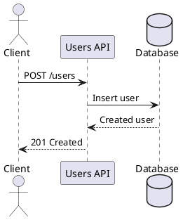

# Users API

API de exemplo para gerenciamento de usuários.

## Recursos

- Listar usuários cadastrados.
- Criar um novo usuário.
- Consultar um usuário pelo identificador.
- Atualizar dados cadastrais.
- Remover um usuário.

## Endpoints

| Método | Rota | Descrição |
| --- | --- | --- |
| `GET` | `/users` | Lista usuários. |
| `POST` | `/users` | Cria um usuário. |
| `GET` | `/users/{id}` | Consulta um usuário por ID. |
| `PUT` | `/users/{id}` | Atualiza um usuário por ID. |
| `DELETE` | `/users/{id}` | Remove um usuário por ID. |

## Fluxo de criação



## Exemplo de payload

```json
{
  "name": "Ada Lovelace",
  "email": "ada@example.com",
  "active": true
}
```
